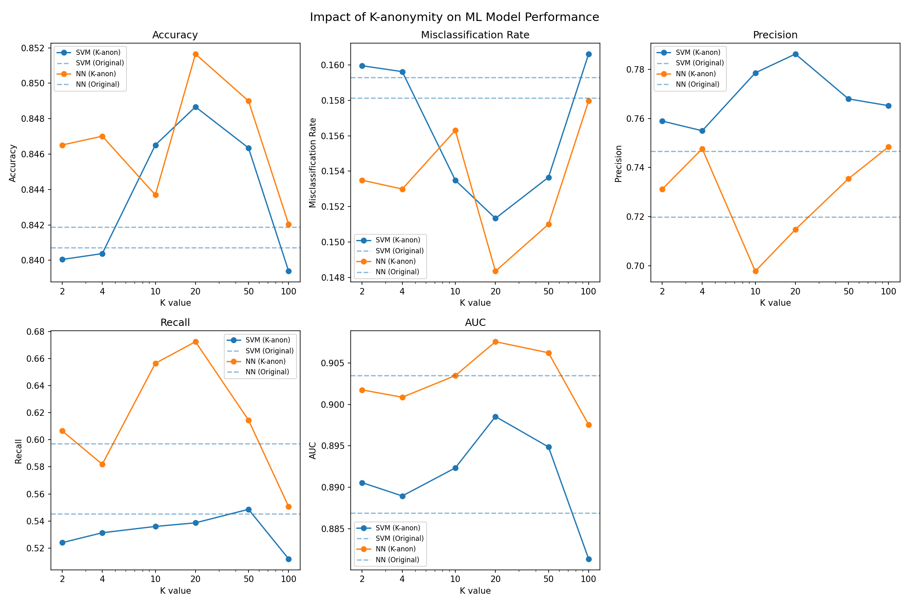
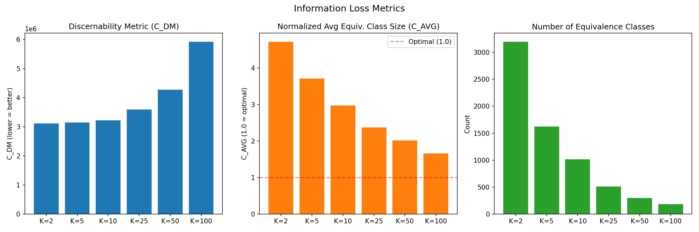

# K-anonymity Experiment


探討 **K-anonymity 隱私保護技術**對機器學習模型效能的影響。使用 Mondrian 多維度 K-anonymity 演算法對 UCI Adult Dataset 進行匿名化處理，並比較匿名化前後 SVM、Neural Network 與 Random Forest 三種模型的表現差異。

## 總覽

本專案實作 Mondrian Multidimensional K-anonymity 演算法，將資料集中的準識別欄位（Quasi-identifiers）進行泛化處理，以達到隱私保護的目的。同時透過訓練 SVM、Neural Network 與 Random Forest 三種模型，觀察不同 K 值下隱私保護對模型效能的影響，量化 **隱私與效用的權衡（Privacy-Utility Trade-off）**。

### 功能特色

- :shield: **K-anonymity 實作** — Mondrian 多維度分割演算法，支援數值型準識別欄位
- :robot: **三模型比較** — SVM（RBF kernel）、Neural Network（3 層 MLP + Dropout）、Random Forest
- :bar_chart: **完整評估指標** — Accuracy、Misclassification Rate、Precision、Recall、AUC
- :chart_with_upwards_trend: **視覺化結果** — 自動產生比較圖表、資訊損失圖表與 CSV 報表
- :test_tube: **多組 K 值實驗** — K = 2, 5, 10, 25, 50, 100
- :brain: **資訊損失量化** — 計算 Mondrian 論文中的 C_DM 與 C_AVG 指標
- :game_die: **多隨機種子** — 每組設定執行 3 次（seeds: 42, 123, 456），報告 mean ± std

## 系統需求

| 項目 | 需求 |
|------|------|
| Python | 3.13+ |
| 套件管理 | [uv](https://docs.astral.sh/uv/) (建議) 或 pip |
| 主要依賴 | PyTorch, scikit-learn, pandas, matplotlib, numpy |
| 資料集 | UCI Adult Dataset（自動下載或本地 `data/adult.data`） |

## 開發環境建置

### 安裝

```bash
# Clone 專案
git clone <repo-url>
cd ntust-security

# 使用 uv 安裝依賴
uv sync

# 或使用 pip
pip install -e .
```

### 執行實驗

```bash
python main.py
```

執行後將自動：
1. 載入 Adult Dataset（約 32,500 筆資料，去除缺失值後約 30,162 筆）
2. 在原始資料上訓練 SVM、Neural Network 與 Random Forest 作為 baseline
3. 對 K = 2, 5, 10, 25, 50, 100 分別進行匿名化並訓練模型
4. 每組設定跑 3 個隨機種子，計算 mean ± std
5. 計算各 K 值的資訊損失指標（C_DM、C_AVG）
6. 產出結果至 `results/` 目錄

## 專案架構

```
ntust-security/
├── main.py              # 實驗主程式，負責流程編排與結果產出
├── mondrian.py          # Mondrian K-anonymity 演算法 + 資訊損失指標
├── ml_models.py         # SVM、Neural Network、Random Forest 模型定義
├── utils.py             # 資料載入、前處理與模型評估工具
├── pyproject.toml       # 專案設定與依賴管理
├── data/
│   └── adult.data       # UCI Adult Dataset（自動下載）
└── results/
    ├── comparison_chart.png     # ML 指標比較圖表
    ├── information_loss.png     # 資訊損失指標圖表
    ├── metrics_table.csv        # 完整 ML 指標 CSV
    ├── information_loss.csv     # 匿名化品質指標 CSV
    ├── anonymized_sample_k2.csv # 匿名化資料樣本（K=2）
    └── report.md                # 完整實驗報告
```

### 模組說明

| 模組 | 功能 |
|------|------|
| `main.py` | 實驗流程控制：資料載入 → 模型訓練 → 匿名化 → 結果比較 → 報告產出 |
| `mondrian.py` | Mondrian 多維度 K-anonymity：遞迴分割、正規化範圍選擇、泛化處理、C_DM/C_AVG 計算 |
| `ml_models.py` | SVM（RBF kernel）、MLP Neural Network（64→32→1, Dropout, PyTorch）、Random Forest |
| `utils.py` | Adult Dataset 載入、Label Encoding、Feature Scaling、Train/Test Split、評估指標計算 |

## 方法說明

### K-anonymity 演算法

採用 **Mondrian Multidimensional K-anonymity**：
- 選擇正規化範圍最大的準識別欄位進行分割
- 在中位數處進行切割，將資料分為兩部分
- 遞迴分割直到每個分區至少包含 K 筆資料
- 對分區內的準識別欄位以**平均值取代**（泛化），確保同一等價類中所有紀錄的 QI 完全相同
- 每個等價類皆驗證 ≥ K 筆紀錄，確保正確性

### 準識別欄位（Quasi-identifiers）

| 屬性 | 類型 | 說明 |
|------|------|------|
| `age` | 數值 | 年齡 |
| `education-num` | 數值 | 教育程度（數值化） |
| `hours-per-week` | 數值 | 每週工作時數 |
| `capital-gain` | 數值 | 資本利得 |
| `capital-loss` | 數值 | 資本損失 |

**敏感屬性**：`income`（年收入 >50K / ≤50K）

> **為什麼只用數值型 QI？** Mondrian 中位數分割演算法是針對有序域（ordered domains）設計的。類別型屬性需要額外的泛化階層（如 國家 → 洲），增加複雜度但不改變本實驗所展示的隱私-效用權衡核心概念。

### 資訊損失指標

源自 Mondrian 論文的匿名化品質量測：

| 指標 | 公式 | 說明 |
|------|------|------|
| **C_DM**（Discernability Metric） | Σ\|E\|² | 各等價類大小平方和，越低越好 |
| **C_AVG**（Normalized Average） | (總筆數 / 等價類數) / K | 正規化平均等價類大小，最佳值為 1.0 |

### 機器學習模型

| 模型 | 參數 |
|------|------|
| **SVM** | scikit-learn SVC, RBF kernel, C=1.0, gamma=scale, probability=True, max_iter=5000 |
| **Neural Network** | PyTorch 3 層 MLP (Input→64→32→1), ReLU + Sigmoid, Dropout 0.3/0.2, Adam (lr=0.001), 30 epochs, batch=256 |
| **Random Forest** | scikit-learn, 100 棵樹, max_depth=15 |

### 評估指標

| 指標 | 說明 |
|------|------|
| Accuracy（準確率） | 正確預測的比例 |
| Misclassification Rate（誤分類率） | 1 − Accuracy |
| Precision（精確率） | 預測為正類中，實際為正類的比例 |
| Recall（召回率） | 實際正類中，被正確預測的比例 |
| AUC | ROC 曲線下面積，衡量排序能力（1.0 = 完美，0.5 = 隨機） |

## 實驗結果摘要

### ML 指標比較



### 資訊損失



### 關鍵發現

- **Random Forest** 在所有 K 值下皆表現最佳，Original Accuracy 達 0.8607
- **Neural Network** 對匿名化最為穩健，K=2 到 K=100 的 Accuracy 變化僅 0.0028
- **SVM** 對匿名化最為敏感，AUC 從 Original 的 0.8875 降至 K=100 的 0.8772
- 整體而言，K-anonymity 在合理的 K 值範圍內，模型效能下降幅度有限（< 2%）

> 完整結果請參閱 [`results/report.md`](results/report.md) 與 [`results/metrics_table.csv`](results/metrics_table.csv)。

## 參考文獻

- K. LeFevre, D. J. DeWitt, and R. Ramakrishnan, "Mondrian multidimensional k-anonymity," *ICDE*, Vol. 6, 2006.
- H. Wimmer and L. Powell, "A comparison of the effects of k-anonymity on machine learning algorithms," *Proceedings of the Conference for Information Systems Applied Research*, Vol. 2167, 2014.
- [UCI Adult Dataset](https://archive.ics.uci.edu/ml/datasets/adult)

## 授權

本專案為 NTUST 資訊安全課程作業。
